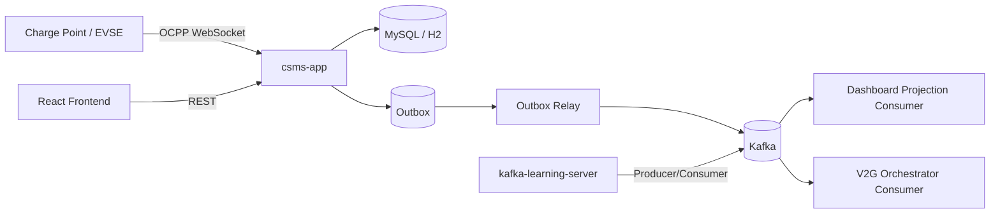

# v2g-csms

OCPP 기반 충전 인프라를 다루는 **CSMS (Charging Station Management System)** 저장소입니다.  
이제 루트는 **Gradle 멀티모듈**로 구성되며, 기존 CSMS 앱과 별도로 **Kafka 학습용 서버 모듈**을 함께 제공합니다.

## 모듈 구성

```text
v2g-csms
├── csms-app                # 기존 OCPP + REST + JPA + Outbox/Kafka 애플리케이션
├── kafka-learning-server   # Kafka producer/consumer 학습용 Spring Boot 서버
├── frontend                # React + Vite 운영 UI
└── docs                    # 아키텍처 / Kafka 문서
```

### 1) `csms-app`

기존 도메인 애플리케이션입니다.

- OCPP WebSocket 인입
- REST 조회 API
- MySQL / H2 기반 영속화
- Outbox + Kafka relay
- Dashboard projection
- V2G orchestration 초안

실행 예시:

```bash
./gradlew :csms-app:bootRun
```

### 2) `kafka-learning-server`

Kafka를 학습하기 위한 별도 서버입니다.

- Spring Kafka 기반 **직접 producer / consumer 연결**
- 로컬 Kafka broker에 바로 접속
- REST로 메시지 발행
- 서버가 소비한 메시지를 메모리 히스토리로 조회
- 학습용 topic 자동 생성

실행 예시:

```bash
./gradlew :kafka-learning-server:bootRun
```

## 현재 아키텍처



## 빠른 시작

### 1. 인프라 실행

```bash
docker compose up -d mysql kafka
```

### 2. CSMS 실행

```bash
./gradlew :csms-app:bootRun
```

### 3. Kafka 학습 서버 실행

```bash
./gradlew :kafka-learning-server:bootRun
```

기본 포트:

- CSMS: `8080` (Spring 기본값)
- Kafka 학습 서버: `8081`
- Kafka broker: `9092`

## Kafka 학습 서버 사용법

### 등록된 학습용 topic 조회

```bash
curl http://localhost:8081/api/learning/kafka/topics
```

### 메시지 발행

```bash
curl -X POST http://localhost:8081/api/learning/kafka/messages \
  -H 'Content-Type: application/json' \
  -d '{
    "topic": "learning.demo.v1",
    "key": "station-001",
    "payload": "hello kafka"
  }'
```

### 서버가 소비한 메시지 조회

```bash
curl 'http://localhost:8081/api/learning/kafka/messages?limit=20'
```

## 외부 Kafka Client로 직접 붙어보기

이 학습 모듈의 핵심은 **`kafka-learning-server` 자체가 Kafka broker에 직접 붙는 Kafka client** 라는 점입니다.  
추가로 `kcat`, Kafka console producer/consumer 같은 외부 클라이언트도 같은 broker(`localhost:9092`)에 바로 연결해서 함께 실습할 수 있습니다.

예시:

```bash
kcat -b localhost:9092 -t learning.demo.v1 -P
kcat -b localhost:9092 -t learning.demo.v1 -C
```

서버와 외부 client를 같이 띄워두면,

- 외부 client → Kafka → `kafka-learning-server` consumer 확인
- `kafka-learning-server` producer → Kafka → 외부 client consumer 확인

형태로 양방향 학습이 가능합니다.

## 참고 문서

- `docs/eda-kafka.md`
- `docs/eda-v2g-smart-charging-platform.md`
- `docs/kafka-learning-module.md`
