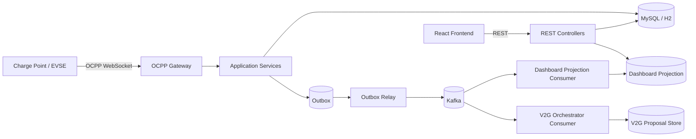

# v2g-csms

OCPP 기반 충전 인프라 도메인을 다루는 **CSMS (Charging Station Management System)** 프로젝트입니다.  
현재는 단일 Spring Boot 애플리케이션 위에 다음 구조를 구현하고 있습니다.

- **OCPP WebSocket 인입**
- **REST 조회 API**
- **MySQL / H2 기반 영속화**
- **Outbox + Kafka relay 기반 EDA 진입점**
- **Dashboard projection**
- **V2G orchestration 초안**
- **React + Vite 기반 운영 UI**

즉, 이 저장소는 단순 CRUD 샘플이 아니라:

> **OCPP 실시간 이벤트를 Kafka 중심 EDA로 확장해 가는 V2G Smart Charging 플랫폼**

을 목표로 진화 중인 코드베이스입니다.

---

## 1. 핵심 목표

- 충전기 OCPP 메시지를 안정적으로 수신한다.
- 트랜잭션 / 계량 / V2G 요구사항을 도메인 단위로 처리한다.
- Kafka를 **ACK 경로에 직접 넣지 않고**, Outbox 기반으로 비동기 전파한다.
- Dashboard와 향후 조회계를 CQRS projection으로 분리한다.
- V2G 정책 평가와 스케줄 제안을 이벤트 기반으로 확장한다.

---

## 2. 현재 아키텍처



### 아키텍처 포인트

- **Write path**
  - OCPP WebSocket handler
  - application service
  - DB 저장
  - outbox 적재
- **Async path**
  - outbox relay → Kafka
  - projection / orchestration consumer
- **Read path**
  - REST API
  - Dashboard projection 또는 live query fallback

---

## 3. 현재 구현 범위

### OCPP 인입

구현된 주요 OCPP 액션:

- `BootNotification`
- `TransactionEvent`
- `StatusNotification`
- `MeterValues`
- `Heartbeat`
- `NotifyEVChargingNeeds`
- `NotifyEVChargingSchedule`
- `ClearedChargingLimit`

관련 패키지:

- `com.charging.adapter.in.websocket`
- `com.charging.adapter.in.websocket.handler`

### 도메인 / 서비스

현재 다루는 주요 도메인:

- `Station`
- `Evse`
- `Connector`
- `Transaction`
- `MeterValue`
- `ChargingNeeds`
- `ChargingProfile`
- `ChargingSchedulePeriod`
- `OutboxEvent`
- `DashboardProjection`
- `V2gScheduleProposal`

주요 서비스:

- `TransactionServiceImpl`
- `ChargingNeedsServiceImpl`
- `ChargingProfileServiceImpl`
- `DashboardServiceImpl`
- `DashboardProjectionService`
- `V2gOrchestratorService`

### EDA / Kafka

현재 구현된 EDA 관련 구성:

- `OutboxEvent`
- `OutboxRelayPublisher`
- `TransactionEventOutboxFactory`
- `MeterValuesOutboxFactory`
- `ChargingNeedsOutboxFactory`
- `V2gScheduleProposalOutboxFactory`
- `DashboardTransactionProjectionConsumer`
- `ChargingNeedsOrchestratorConsumer`

### 프론트엔드

`frontend/` 에는 운영 UI가 포함되어 있습니다.

주요 화면:

- Dashboard
- Stations
- Station Detail
- Transactions
- V2G

기술:

- React 19
- Vite 7
- TypeScript
- MUI
- TanStack Query

---

## 4. 프로젝트 구조

현재 구조는 **layer-first + feature 확장형**입니다.

```text
src/main/java/com/charging
├── adapter
│   ├── in
│   │   ├── web
│   │   ├── websocket
│   │   └── messaging/kafka
│   └── out
│       ├── persistence
│       └── messaging/kafka
├── application
│   ├── service
│   └── outbox
├── domain
│   ├── entity
│   ├── enums
│   ├── exception
│   └── port
└── ChargingDomainApplication.java
```

### 각 레이어 역할

- `adapter.in.web`
  - REST API
- `adapter.in.websocket`
  - OCPP WebSocket ingress
- `adapter.in.messaging.kafka`
  - Kafka consumer
- `adapter.out.persistence`
  - JPA repository / persistence adapter
- `adapter.out.messaging.kafka`
  - outbox relay publisher
- `application.service`
  - 유스케이스 / orchestration
- `application.outbox`
  - outbox payload 생성
- `domain`
  - 엔티티, enum, port

---

## 5. 현재 이벤트 흐름

### 5.1 Transaction 이벤트

```text
TransactionEvent
 -> TransactionServiceImpl
 -> Transaction 저장
 -> OutboxEvent 저장
 -> OutboxRelayPublisher
 -> Kafka topic: ocpp.transaction.v1
```

### 5.2 MeterValues hot path

```text
MeterValues
 -> 활성 Transaction 조회
 -> MeterValue batch saveAll
 -> OutboxEvent 저장
 -> Kafka topic: ocpp.meter-value.v1
```

### 5.3 V2G orchestration

```text
NotifyEVChargingNeeds
 -> ChargingNeeds 저장
 -> OutboxEvent 저장
 -> Kafka topic: ocpp.v2g.charging-needs.v1
 -> ChargingNeedsOrchestratorConsumer
 -> V2gOrchestratorService
 -> V2gScheduleProposal 저장
 -> OutboxEvent 저장
 -> Kafka topic: ocpp.v2g.charging-schedule.v1
```

### 5.4 Dashboard projection

```text
Transaction Kafka event
 -> DashboardTransactionProjectionConsumer
 -> DashboardProjectionService.refreshProjection()
 -> DASHBOARD_PROJECTION 갱신
```

---

## 6. Kafka / Outbox 전략

이 프로젝트는 다음 원칙을 따릅니다.

### 핵심 원칙

- **Kafka를 OCPP ACK 경로에 직접 넣지 않는다**
- **도메인 상태 변경 + Outbox 적재를 먼저 한다**
- **Kafka 전송은 relay가 비동기로 맡는다**

### 현재 topic

- `ocpp.transaction.v1`
- `ocpp.meter-value.v1`
- `ocpp.v2g.charging-needs.v1`
- `ocpp.v2g.charging-schedule.v1`

### 현재 상태

- relay는 구현되어 있음
- consumer도 초안이 있음
- 기본값은 로컬 안정성을 위해 대부분 **비활성화**

---

## 7. 기술 스택

### Backend

- Java 25 (toolchain)
- Spring Boot 3.5.6
- Spring Web
- Spring WebSocket
- Spring Data JPA
- Spring Kafka
- Flyway
- Lombok

### Database

- MySQL 8
- H2 (dev profile)

### Frontend

- React 19
- TypeScript
- Vite 7
- MUI
- TanStack Query
- Recharts

### Build / Test

- Gradle Wrapper 8.14.3
- JUnit 5

---

## 8. 실행 방법

## 8.1 백엔드

### 1) MySQL 실행

```bash
docker compose up -d
```

### 2) 애플리케이션 실행

```bash
./gradlew bootRun
```

또는 H2 개발 모드:

```bash
./gradlew bootRun --args='--spring.profiles.active=dev'
```

### 3) 테스트 실행

현재 Gradle runtime은 Java 21로 실행하는 것을 권장합니다.

```bash
export JAVA_HOME=$(/usr/libexec/java_home -v 21)
export PATH="$JAVA_HOME/bin:$PATH"
./gradlew test
```

> 참고: 프로젝트 컴파일은 Java 25 toolchain을 사용하지만, 현재 로컬 검증은 Java 21 runtime으로 실행하고 있습니다.

---

## 8.2 프론트엔드

```bash
cd frontend
npm install
npm run dev
```

---

## 9. 주요 설정

`application.yml` 에서 다음 항목을 제어합니다.

### Kafka / Outbox

- `app.outbox.relay.enabled`
- `app.outbox.relay.fixed-delay-ms`
- `app.outbox.relay.batch-size`
- `app.outbox.relay.max-retry-count`

### Dashboard projection

- `app.dashboard.projection.enabled`
- `app.dashboard.projection.consumer.enabled`

### V2G orchestrator

- `app.v2g.orchestrator.consumer.enabled`

---

## 10. 테스트 현황

현재 포함된 주요 테스트:

- `TransactionServiceImplTest`
- `MeterValuesHandlerTest`
- `ChargingNeedsServiceImplTest`
- `V2gOrchestratorServiceTest`

검증 포인트:

- Transaction outbox 적재
- MeterValues batch save + outbox 적재
- ChargingNeeds outbox 적재
- V2G proposal 생성 및 outbox 적재

---

## 11. 현재 한계와 다음 단계

### 현재 한계

- relay는 polling 기반
- Dashboard projection은 incremental aggregation이 아니라 refresh 기반
- V2G orchestration은 아직 heuristic 기반
- 실제 OCPP schedule dispatch 까지는 아직 가지 않음
- MeterValues raw store는 아직 MySQL 중심

### 다음 단계

- Metering 전용 저장소/고TPS pipeline 강화
- Dashboard projection incremental update
- `GridPolicyEvaluated` 중간 이벤트 추가
- Proposal → ChargingProfile/Dispatch 단계 연결
- observability / consumer lag / DLQ 고도화

---

## 12. 추가 문서

- [EDA + Kafka 적용 가이드](docs/eda-kafka.md)
- [V2G Smart Charging Event Platform 설계안](docs/eda-v2g-smart-charging-platform.md)
- [EDA 패키지 구조 설계안](docs/package-structure-eda.md)

---

## 13. 저장소 성격

이 저장소는 “완성된 제품” README라기보다,

> **OCPP + Kafka + Outbox + CQRS + V2G Orchestrator 방향으로 진화 중인 실전형 아키텍처 실험 저장소**

에 가깝습니다.

따라서 README도 “이상적인 목표”보다 **현재 구현 상태와 다음 단계**를 기준으로 유지합니다.
