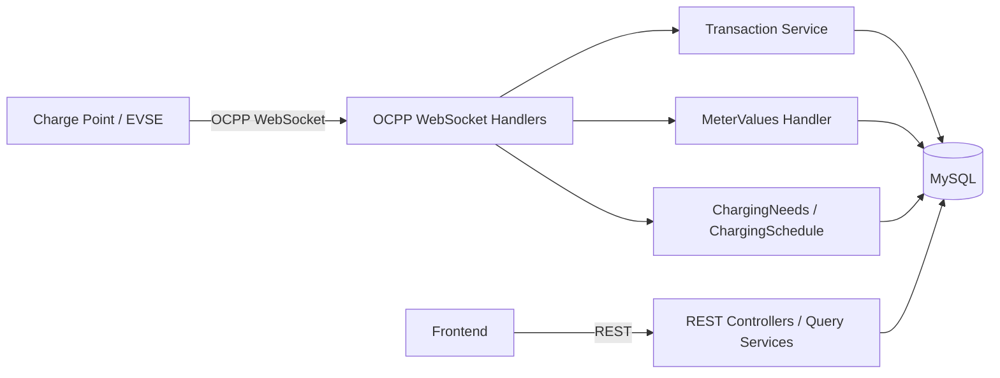
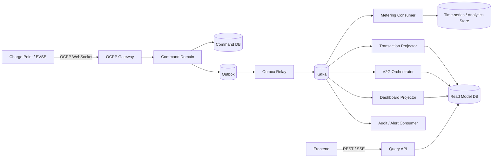
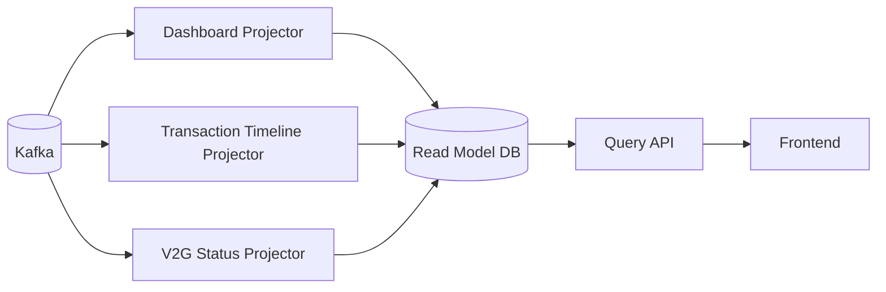
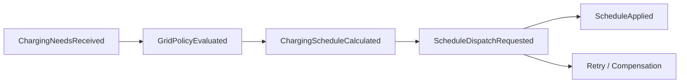

# V2G Smart Charging Event Platform 설계안

## 1. 문서 목적

이 문서는 현재 `v2g-csms` 저장소를 기준으로, 프로젝트를 다음 방향으로 진화시키기 위한 목표 아키텍처를 정의합니다.

- **OCPP WebSocket 인입**
- **Kafka 기반 EDA (Event-Driven Architecture)**
- **Outbox 패턴 기반 정합성 확보**
- **CQRS Read Model 분리**
- **TPS 10,000 시나리오를 고려한 Metering/V2G 확장**

핵심 목표는 단순히 Kafka를 붙이는 것이 아니라, **실시간 충전 이벤트를 안전하게 수집하고, 비동기적으로 확장 가능한 플랫폼**으로 전환하는 것입니다.

---

## 2. 현재 저장소 현실 진단

현재 프로젝트는 빈 뼈대가 아니라 이미 다음 요소를 갖추고 있습니다.

- **단일 Spring Boot 애플리케이션**
- **OCPP WebSocket 인입**
- **REST Query API**
- **JPA/MySQL 영속화**
- **Dashboard/Stations/Transactions/V2G 프론트엔드**

즉 현재 구조는 이미 다음 성격을 가집니다.

- **Write path**: OCPP WebSocket handler → service/port → MySQL
- **Read path**: REST controller → query service → frontend

따라서 현 시점에서 가장 안전하고 현실적인 전략은:

> **모놀리스 → 모듈형 모놀리스 + Outbox + Kafka + CQRS → 필요한 부분만 서비스 분리**

입니다.

---

## 3. 목표 프로젝트 컨셉

### 프로젝트 이름 제안

**V2G Smart Charging Event Platform**

### 한 줄 설명

> OCPP 기반 충전 이벤트를 Kafka 중심으로 비동기 전파하고, 충전 세션·계량 데이터·V2G 스케줄링·조회계를 분리한 실시간 이벤트 플랫폼

### 왜 이 방향이 좋은가

1. **도메인 차별성**: EV Charging / OCPP / V2G
2. **분산 시스템 포인트**: Kafka, Outbox, CQRS, Idempotency
3. **성능 포인트**: 고TPS Metering pipeline
4. **스토리텔링 포인트**: 단순 CRUD가 아니라 정책/오케스트레이션이 있음

---

## 4. 현재 구조와 목표 구조

### 4.1 현재 구조



### 4.2 목표 구조



---

## 5. 핵심 아키텍처 원칙

### 5.1 Kafka를 충전기 ACK 경로에 직접 넣지 않는다

권장 흐름:

```text
OCPP 수신
 -> validation
 -> domain 처리
 -> DB 반영 + outbox insert (same tx)
 -> 즉시 ACK 반환
 -> outbox relay가 Kafka publish
 -> downstream consumer들이 비동기 처리
```

이 원칙이 중요한 이유:

- 충전기 응답 latency 안정화
- Kafka 장애와 OCPP ACK 경로 분리
- DB 상태와 이벤트 발행 정합성 확보
- 재시도/재처리 가능

### 5.2 Metering은 별도 hot path로 취급한다

TPS 10,000 시나리오에서 가장 먼저 병목이 나는 영역은 `MeterValues` 입니다.

따라서 Metering은:

- 별도 topic 분리
- batch write
- read model 분리
- 가능하면 시계열/분석 저장소 활용

전략으로 설계합니다.

### 5.3 Read Model은 운영 DB 직접 조회에서 분리한다

현재 Dashboard/Transaction 조회는 운영 DB 직접 조회 성격이 강합니다.  
목표 구조에서는 Kafka consumer가 projection을 만들고, 프론트는 projection 기반 API만 조회합니다.

---

## 6. Bounded Context / 모듈 정의

### 6.1 OCPP Gateway

책임:

- WebSocket 세션 관리
- OCPP payload validation
- action dispatch
- 최소 command 처리 진입
- 빠른 ACK 반환

현재 관련 코드:

- `adapter/in/websocket/*`

### 6.2 Transaction Lifecycle

책임:

- `TransactionStarted`
- `TransactionStateUpdated`
- `TransactionEnded`
- active transaction 관리

현재 관련 코드:

- `TransactionEventHandler`
- `TransactionServiceImpl`

### 6.3 Metering

책임:

- `MeterValueRecorded`
- 고빈도 raw ingest
- batch persistence
- 통계/분석용 projection

현재 관련 코드:

- `MeterValuesHandler`

### 6.4 Smart Charging / V2G

책임:

- `ChargingNeedsReceived`
- charging schedule 계산
- V2G 정책 평가
- schedule dispatch orchestration

현재 관련 코드:

- `NotifyEVChargingNeedsHandler`
- `NotifyEVChargingScheduleHandler`
- `ChargingNeedsServiceImpl`
- `ChargingProfile*`

### 6.5 Read Model

책임:

- dashboard projection
- station detail projection
- transaction timeline projection
- V2G status projection

현재 관련 코드:

- `DashboardServiceImpl`
- REST query controllers
- frontend 전체

---

## 7. Kafka Topic 설계

| Topic | Key | 주요 이벤트 | 비고 |
|---|---|---|---|
| `ocpp.transaction.v1` | `transactionId` | `TransactionStarted`, `TransactionStateUpdated`, `TransactionEnded` | 세션 순서 보장 |
| `ocpp.meter-value.v1` | `stationId:evseId` 또는 `transactionId` | `MeterValueRecorded` | 고TPS hot path |
| `ocpp.v2g.charging-needs.v1` | `stationId:evseId` | `ChargingNeedsReceived` | V2G 입력 이벤트 |
| `ocpp.v2g.charging-schedule.v1` | `stationId:evseId` | `ChargingScheduleCalculated`, `ChargingScheduleReceived`, `ScheduleDispatchRequested` | V2G orchestration |
| `csms.retry.v1` | 원본 key 유지 | retry 대상 이벤트 | 운영 안정성 |
| `csms.dlq.v1` | 원본 key 유지 | 처리 실패 이벤트 | 장애 분석 |

### 7.1 Partition 전략

초기 예시:

- `ocpp.transaction.v1`: 12~24 partitions
- `ocpp.meter-value.v1`: 48~96 partitions
- `ocpp.v2g.*`: 12~24 partitions

원칙:

- **transaction 순서 보장**이 중요하면 `transactionId` key 사용
- **EVSE 단위 순서 보장**이 중요하면 `stationId:evseId` key 사용
- Metering은 처리량 우선이므로 partition 수를 가장 크게 시작

---

## 8. 이벤트 Envelope 표준

모든 Kafka 이벤트는 다음 공통 envelope를 갖습니다.

```json
{
  "eventId": "uuid",
  "eventType": "TransactionStarted",
  "eventVersion": 1,
  "occurredAt": "2026-03-16T13:00:00Z",
  "stationId": "ST-001",
  "evseId": 1,
  "transactionId": "TXN-123",
  "correlationId": "ocpp-message-id",
  "producer": "ocpp-gateway",
  "payload": {}
}
```

필수 필드:

- `eventId`
- `eventType`
- `occurredAt`
- `stationId`
- `correlationId`

이유:

- 멱등 처리
- end-to-end tracing
- replay
- 장애 원인 분석

---

## 9. Outbox 설계

### 9.1 Outbox 도입 이유

다음 두 연산을 한 트랜잭션으로 묶기 위함입니다.

1. 도메인 상태 변경
2. 이벤트 발행 예정 기록

즉:

```text
Business state change + Outbox insert == same DB transaction
```

이후 relay가 outbox를 읽어 Kafka로 publish 합니다.

### 9.2 Outbox 테이블 예시

```sql
CREATE TABLE outbox_event (
    id BIGINT NOT NULL AUTO_INCREMENT,
    event_id VARCHAR(64) NOT NULL,
    aggregate_type VARCHAR(50) NOT NULL,
    aggregate_id VARCHAR(100) NOT NULL,
    topic VARCHAR(100) NOT NULL,
    event_type VARCHAR(100) NOT NULL,
    event_version INT NOT NULL,
    partition_key VARCHAR(100) NOT NULL,
    payload JSON NOT NULL,
    status VARCHAR(20) NOT NULL DEFAULT 'INIT',
    retry_count INT NOT NULL DEFAULT 0,
    occurred_at DATETIME(6) NOT NULL,
    published_at DATETIME(6) NULL,
    created_at DATETIME(6) NOT NULL,
    updated_at DATETIME(6) NOT NULL,
    PRIMARY KEY (id),
    UNIQUE KEY uk_outbox_event_id (event_id),
    KEY idx_outbox_status_created (status, created_at),
    KEY idx_outbox_aggregate (aggregate_type, aggregate_id)
);
```

### 9.3 Relay 책임

- `INIT` 상태 이벤트 조회
- Kafka publish
- 성공 시 `PUBLISHED`
- 실패 시 `retry_count` 증가
- 임계 초과 시 DLQ 또는 `FAILED`

---

## 10. CQRS / Read Model 설계

### 10.1 분리 대상 Read Model

- Dashboard Summary
- Station Detail View
- Transaction Timeline View
- V2G Status View

### 10.2 전략



초기에는 MySQL 내 projection table로 시작해도 됩니다.  
이후 트래픽/조회 패턴에 따라 Redis, PostgreSQL, Elasticsearch 등을 도입할 수 있습니다.

---

## 11. V2G 오케스트레이션 설계

이 프로젝트를 이력서에서 가장 강하게 만드는 포인트는 **V2G Orchestrator** 입니다.

### 11.1 이벤트 흐름



### 11.2 책임

- EV charging needs 수신
- 전력 정책/가용 용량 평가
- 충전/방전 스케줄 계산
- 실패 시 retry 또는 보상 처리

### 11.3 포트폴리오 가치

이 흐름이 있으면 프로젝트가 단순한 “충전기 서버”가 아니라:

> **실시간 이벤트를 기반으로 정책 의사결정까지 수행하는 분산 플랫폼**

으로 보입니다.

---

## 12. 10k TPS 시나리오에서의 핵심 병목과 대응

### 12.1 병목: WebSocket → DB 동기 처리

대응:

- ACK-fast
- persist-fast
- async publish

### 12.2 병목: MeterValues 개별 insert

대응:

- metering topic 분리
- batch insert
- 압축/집계
- 시계열 저장소 검토

### 12.3 병목: active transaction lookup 비용

대응:

- `(stationId, evseId) -> activeTransactionId` 캐시
- projection table 또는 Redis 사용

### 12.4 병목: Dashboard 운영 DB 직접 조회

대응:

- projection 기반 query 전환

### 12.5 병목: delete + insert 기반 schedule 처리

대응:

- versioned event
- upsert projection

### 12.6 병목: 과도한 SQL 로그

대응:

- production에서 SQL DEBUG/TRACE 제거
- structured application log 중심 운영

---

## 13. 단계별 실행 로드맵

### Phase 1 — Modular Monolith + Outbox

목표:

- 현재 저장소를 크게 흔들지 않고 EDA 도입 기반 마련

실행:

1. `TransactionEventHandler` / `TransactionServiceImpl` 이벤트화
2. `outbox_event` 테이블 추가
3. outbox relay 구현
4. Kafka producer 연동
5. Dashboard projection consumer 추가

### Phase 2 — High-throughput Metering

목표:

- TPS 10,000 스토리를 만들어 줄 핵심 pipeline 확보

실행:

1. `MeterValuesHandler`를 direct save 구조에서 분리
2. `ocpp.meter-value.v1` topic 도입
3. batch ingest consumer 도입
4. meter read model / analytics store 설계
5. 성능 테스트 및 lag 측정

### Phase 3 — V2G Orchestrator

목표:

- 프로젝트의 차별화 포인트 강화

실행:

1. `ChargingNeedsReceived`
2. `GridPolicyEvaluated`
3. `ChargingScheduleCalculated`
4. `ScheduleDispatchRequested`
5. retry / compensation

### Phase 4 — Service Decomposition

분리 순서 권장:

1. `metering-service`
2. `read-model-service`
3. `v2g-orchestrator`
4. `transaction-service`

`ocpp-gateway`는 마지막에 물리 분리해도 충분합니다.

---

## 14. 현재 코드에서 바로 손댈 첫 지점

### 14.1 Transaction 이벤트부터 시작

이유:

- aggregate 경계가 명확함
- Kafka key 설계가 쉬움
- 비즈니스 흐름 설명이 깔끔함

### 14.2 Metering은 두 번째

이유:

- 고TPS 설명의 핵심
- 현재 구조상 가장 큰 병목

### 14.3 Dashboard는 projection으로 전환

이유:

- CQRS 효과를 눈에 보이게 보여줄 수 있음
- 프론트와 연결된 데모 가치가 큼

---

## 15. 이력서/포트폴리오용 서술 예시

### 이력서 bullet 예시

- OCPP 기반 EV Charging CSMS를 Kafka 중심 EDA로 재설계하고, Outbox 패턴과 멱등 Consumer를 통해 이벤트 정합성과 재처리 안정성을 확보
- Transaction/Metering/V2G 도메인을 CQRS 구조로 분리하고, Dashboard Projection 기반 조회계를 구축해 운영 DB의 read 부담을 감소
- TPS 10,000 시나리오를 가정해 MeterValues hot path를 분리하고 partition key, retry/DLQ, lag monitoring 전략을 설계

### GitHub README / 포트폴리오 문장 예시

> 실시간 OCPP 충전 이벤트를 Kafka 기반 비동기 아키텍처로 전환하고, V2G 정책 의사결정과 고TPS Metering pipeline을 분리한 이벤트 플랫폼

---

## 16. 최종 권장 방향

이 저장소의 최종 방향은 아래 한 문장으로 요약할 수 있습니다.

> **OCPP + Kafka + Outbox + CQRS + V2G Orchestrator**

즉 이 프로젝트는 단순한 충전기 CRUD 서버가 아니라:

> **실시간 충전 이벤트를 받아 고TPS 계량 처리와 V2G 의사결정까지 수행하는 분산 이벤트 플랫폼**

으로 발전시키는 것이 가장 좋습니다.
