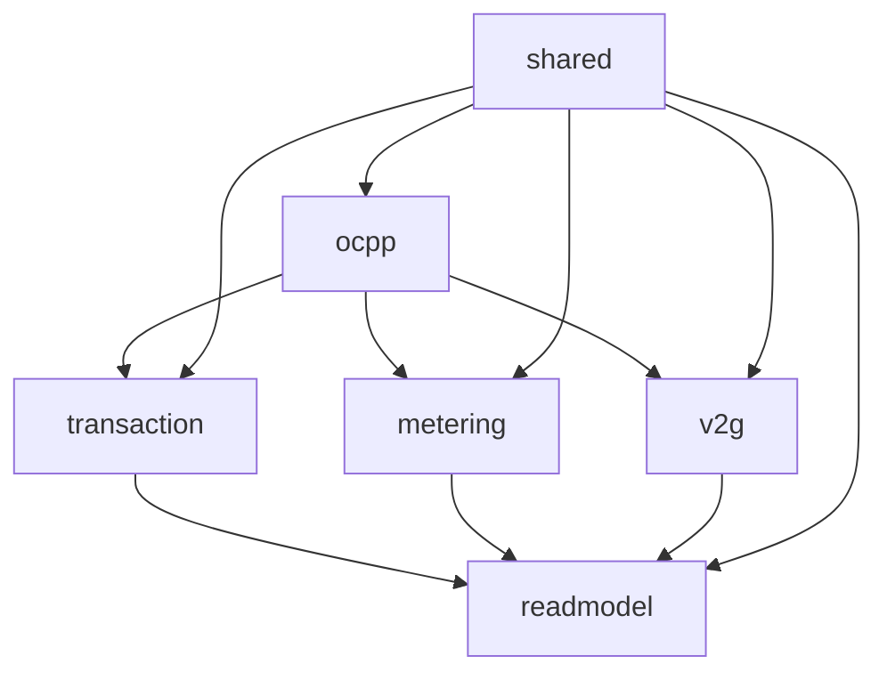
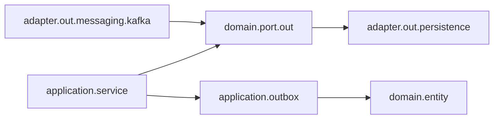

# EDA 패키지 구조 설계안

## 1. 목적

이 문서는 현재 계층형 패키지 구조를 유지하면서도, 향후 Kafka 기반 EDA 구조로 자연스럽게 진화할 수 있도록 **feature/bounded context 중심 패키지 목표 구조**를 정의합니다.

핵심 원칙:

- 처음부터 서비스 분리하지 않는다.
- 먼저 **모듈형 모놀리스**로 경계를 분명히 한다.
- Kafka, Outbox, Read Model은 cross-cutting이 아니라 **도메인 흐름의 일부**로 둔다.

---

## 2. 현재 구조의 특징

현재는 전형적인 layer-first 구조입니다.

```text
com.charging
├── adapter
│   ├── in
│   │   ├── web
│   │   └── websocket
│   └── out
│       └── persistence
├── application
│   └── service
└── domain
    ├── entity
    ├── enums
    └── port
```

장점:

- 빠르게 기능을 추가하기 쉬움
- 현재 규모에서 이해하기 쉬움

한계:

- Transaction / Metering / V2G 경계가 package level에서 잘 안 보임
- Kafka/Outbox 도입 시 “기술 패키지”로 흩어질 위험이 있음
- 이후 서비스 분리 기준을 package만 보고 파악하기 어려움

---

## 3. 목표 구조

### 3.1 목표 개념도



### 3.2 목표 패키지 트리

```text
com.charging
├── shared
│   ├── config
│   ├── json
│   ├── outbox
│   └── support
├── ocpp
│   ├── adapter
│   │   └── websocket
│   ├── application
│   └── model
├── transaction
│   ├── domain
│   │   ├── entity
│   │   ├── event
│   │   └── port
│   ├── application
│   ├── adapter
│   │   ├── in
│   │   └── out
│   └── readmodel
├── metering
│   ├── domain
│   ├── application
│   ├── adapter
│   └── readmodel
├── v2g
│   ├── domain
│   ├── application
│   ├── adapter
│   └── orchestrator
└── readmodel
    ├── dashboard
    ├── station
    └── transaction
```

---

## 4. 첫 단계에서 실제로 추가할 패키지

완전한 리팩토링 전에, 이번 1차 구현에서는 아래 패키지만 추가하는 것이 안전합니다.

```text
com.charging
├── application
│   └── outbox
│       └── dto
├── adapter
│   └── out
│       ├── messaging
│       │   └── kafka
│       └── persistence
│           ├── adapter
│           └── repository
└── domain
    ├── entity
    ├── enums
    └── port
        └── out
```

이 방식의 장점:

- 기존 계층형 구조를 크게 깨지 않음
- Outbox/Kafka를 독립 패키지로 묶어 변화 지점이 명확함
- 나중에 `shared.outbox`, `transaction.event` 등으로 옮기기 쉬움

---

## 5. 패키지별 책임

### 5.1 `application.outbox`

역할:

- 도메인 상태를 Outbox 이벤트로 변환
- event payload 생성
- topic/key/eventType 결정

이번 1차 구현 대상:

- `TransactionEventOutboxFactory`
- `TransactionEventPayload`

### 5.2 `adapter.out.messaging.kafka`

역할:

- Outbox relay
- Kafka publish
- retry / failed 상태 갱신

이번 1차 구현 대상:

- `OutboxRelayPublisher`

### 5.3 `domain.entity` / `domain.port.out`

역할:

- OutboxEvent 저장 모델
- Outbox 저장/조회 port

이번 1차 구현 대상:

- `OutboxEvent`
- `OutboxStatusEnum`
- `OutboxEventPort`

---

## 6. 의존 방향



원칙:

- `application.service` 는 Kafka를 직접 몰라도 된다.
- service는 **Outbox event를 만든 뒤 port에 저장만** 한다.
- Kafka publish는 relay가 맡는다.

---

## 7. 단계별 리팩토링 방향

### Step 1 — 현재 구조 유지 + Outbox 추가

- `TransactionServiceImpl` 에서 transaction 저장 후 outbox 저장
- Kafka relay는 adapter 밖에서만 동작

### Step 2 — feature 중심 분리 시작

- `transaction` 관련 entity/service/adapter를 하나의 feature 경계로 재배치
- `metering`, `v2g`도 동일 패턴 적용

### Step 3 — query/readmodel 분리

- `dashboard`
- `transaction timeline`
- `station detail`

projection consumer 기준으로 readmodel 패키지 분리

### Step 4 — 물리 서비스 분리

우선순위:

1. `metering-service`
2. `readmodel-service`
3. `v2g-orchestrator`
4. `transaction-service`

---

## 8. 결론

이 프로젝트는 지금 당장 package를 전부 갈아엎는 것보다:

> **기존 계층형 구조 위에 Outbox/Kafka 패키지를 작게 추가하고, 이후 bounded context 중심 구조로 단계적으로 전환**

하는 것이 가장 안전합니다.

즉 이번 1차 구현은 **리팩토링 종착점이 아니라, 미래 패키지 구조를 위한 첫 안전한 발판**입니다.
